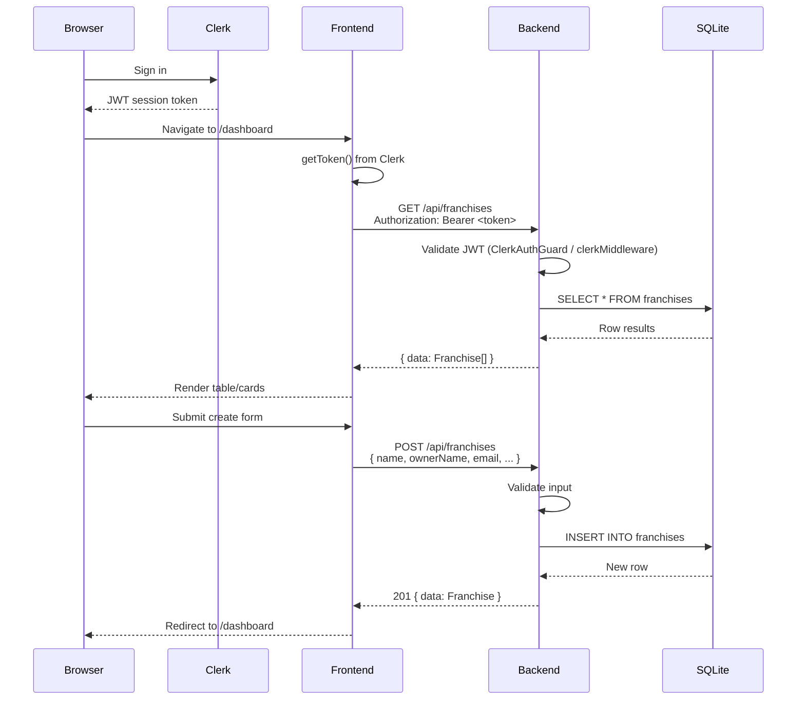

## Data Flow & Integrations

Data in the Franchise Manager flows from the browser through an authenticated frontend, across REST API calls to a backend that persists to SQLite. The system has one external integration: Clerk for authentication.

## Module Dependencies

| Module | Depends On | Purpose |
|--------|-----------|---------|
| `@franchise/shared` | (none) | Types, DTOs, constants — foundation for all apps |
| `backend-express` | `@franchise/shared`, `better-sqlite3`, `@clerk/express` | Express REST API |
| `backend-nestjs` | `@franchise/shared`, `better-sqlite3`, `@nestjs/*`, Clerk JWT | NestJS REST API |
| `frontend-nextjs` | `@franchise/shared`, `@clerk/nextjs`, React | Next.js frontend |
| `frontend-svelte` | `@franchise/shared`, `svelte-clerk`, Svelte | SvelteKit frontend |

## Service Layer

| Service | File | Methods | Description |
|---------|------|---------|-------------|
| `DatabaseService` | `apps/backend-nestjs/src/database/database.service.ts` | `onModuleInit()`, `onModuleDestroy()`, `getDatabase()` | Manages SQLite connection lifecycle |
| `FranchiseService` | `apps/backend-nestjs/src/franchise/franchise.service.ts` | `findAll()`, `findOne()`, `create()`, `update()`, `remove()` | Business logic for franchise CRUD |
| Express route handlers | `apps/backend-express/src/routes/franchises.ts` | GET, POST, PUT, PATCH, DELETE handlers | Inline business logic in route functions |

## High-level Flow

## Internal Movement

### Request Pipeline (NestJS)

1. **HTTP Request** arrives at NestJS
2. **Global Guard** (`ClerkAuthGuard`) validates JWT token
3. **Controller** (`FranchiseController`) receives validated request
4. **Service** (`FranchiseService`) executes business logic
5. **Database** (`DatabaseService.getDatabase()`) runs SQL query
6. **Response** flows back through controller to client

### Request Pipeline (Express)

1. **HTTP Request** arrives at Express
2. **CORS middleware** validates origin
3. **Clerk middleware** (`clerkMiddleware()`) validates JWT
4. **Route handler** in `routes/franchises.ts` executes SQL directly
5. **Response** returned with `ApiResponse` wrapper

### Frontend Data Flow

1. **Page load** triggers `onMount` / `useEffect` → calls API client function
2. **API client** (`lib/api.ts`) retrieves Clerk token and makes `fetch()` request
3. **Response** parsed and stored in component state (`useState` / `$state`)
4. **Derived state** computes metrics (active/pending/inactive counts)
5. **User interaction** (search, create, edit, delete) triggers new API calls
6. **Toast notifications** (Svelte) or redirects (Next.js) confirm operations

## External Integrations

### Clerk Authentication

| Aspect | Details |
|--------|---------|
| **Purpose** | User identity, session management, sign-in UI |
| **Auth method** | JWT Bearer tokens |
| **Frontend integration** | `ClerkProvider` wraps the app; `getToken()` retrieves session token |
| **Backend integration** | Express: `clerkMiddleware()` / NestJS: `ClerkAuthGuard` validates tokens |
| **Token format** | JWT with `sub` (userId), `sid` (sessionId), `exp` (expiration) claims |
| **Failure handling** | Invalid/expired tokens return 401 Unauthorized |
| **Required secrets** | `CLERK_SECRET_KEY` (backend), `CLERK_PUBLISHABLE_KEY` (frontend) |

## Observability & Failure Modes

- **Logging**: Default console logging in both backends. No structured logging framework configured.
- **Error responses**: Wrapped in `ApiErrorResponse` format (`{ error: string, message?: string }`).
- **Database errors**: Caught in try/catch blocks. Express returns 500 with error message. NestJS uses exception filters.
- **Auth failures**: Return 401 with descriptive error message.
- **Network failures**: Frontend API clients catch fetch errors and display user-facing error messages or toast notifications.
- **No retry logic**: API calls are single-attempt. No exponential backoff or retry mechanism.
- **No health monitoring**: Express has a `GET /health` endpoint returning 200. NestJS has no health check.

## Related Resources

- [architecture.md](./architecture.md)
